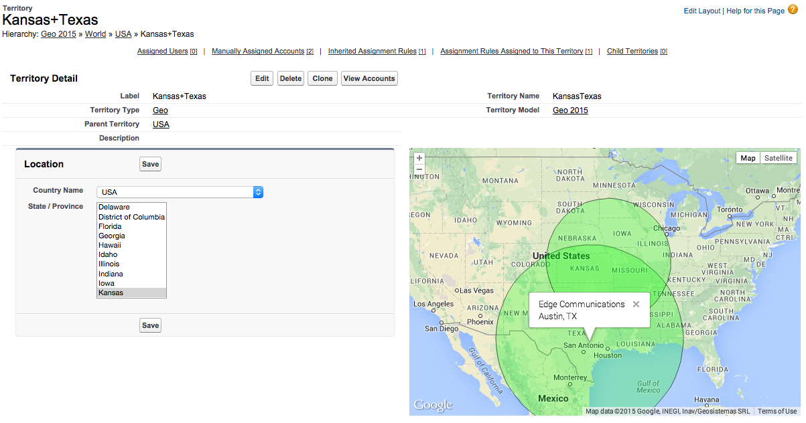

This package adds two helpful utilities to Enterprise Territory Management:
* Using country/state picklists, create and edit the underlying rules for a territory
* Visualize a territory on a Google Map by seeing all the assigned accounts

## Country/State picklists
When creating or editing a geo-based territory, it can be cumbersome to write the appropriate territory rules. Instead, you can embed this Visualforce page onto the Territory Detail Page. Using two dependent picklists (one for country, one for state), you can multi-select the geo regions for this territory and save from within the page.

## Google Maps integration
To get more insight on your geo-based territory, try projecting it onto a Google Map. This Visualforce page will use a geolocation field on the Accounts to place them on the map. If you're using Expected Revenue or a similar field that designates account potential, a circle will be drawn around each Account. A bigger circle signifies a more imporant Account.
